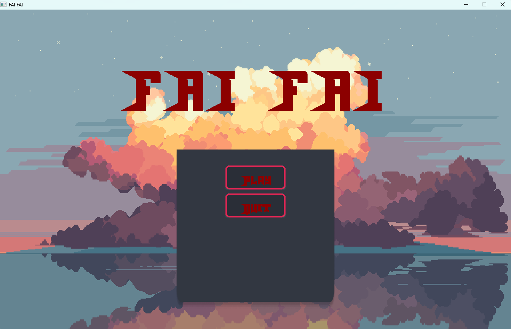
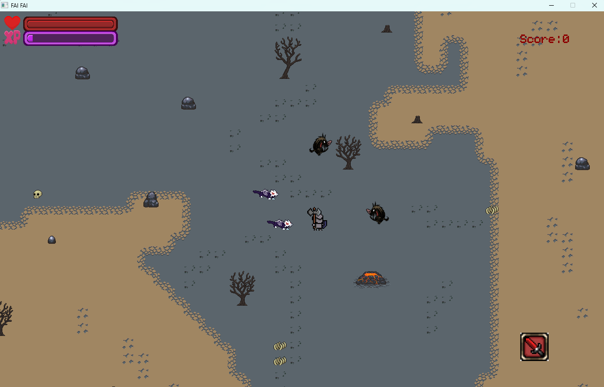
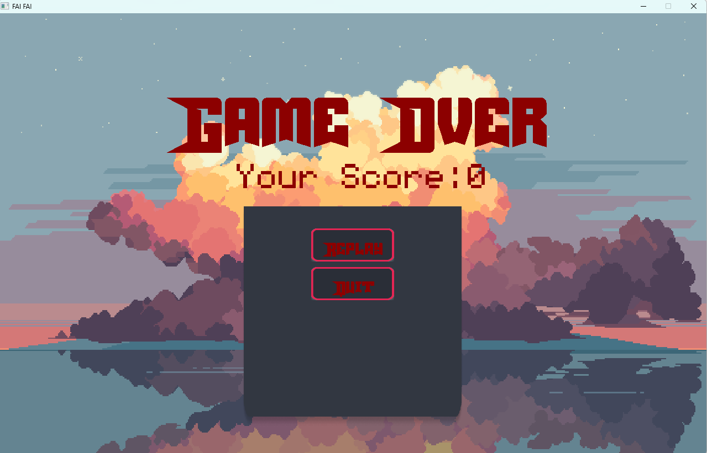

# ****FAI_FAI****

## ***Giới thiệu về bản thân***

  - Họ và tên: Trần Trung Hậu
    
  - Mã Sinh Viên: 23020061

  - Lớp học phần: 2324II_INT2215_50

## ***Giới thiệu về game***

  *Đây là thể loại game Top-Down kể về một chiến sĩ bị lạc ở giữa hòn đảo xung quanh toàn là những động vật bị nguy hiểm chưa từng được phát hiện.*
  
  *Chúng chạy rượt đuổi theo chảng hiệp sĩ và muốn sinh tồn trên hòn đảo này chàng phải chạy trốn khỏi bọn chúng và tìm cách tiêu diệt đám quái vật này.*

Video giới thiệu về game: https://youtu.be/PNMk6r0HRRo

## ***Cách thức chơi game***
  *Bạn phải tìm cách nẽ tránh những đòn tấn công của những còn quái vật hung hăng và tìm cơ hội để tấn công chúng.* 
  
  *Khi tiêu diệt một con quái vật bạn sẽ được nhận một lượng exp nhất định tùy thuộc vào loại quái mà bạn tiêu diệt. Khi để chúng tấn công bạn sẽ mất máu.*

## **Thông tin về loại quái**

|   Quái  | Máu | Kinh nghiệm nhận được khi tiêu diệt | 
|---------|----------|----------|
|         |    10    |    10    |
|         |     15     |     15    |

## **Thông số về từng cấp độ của nhân vật**

| Cấp | Nhân vật | Giáp |
|-----|----------|------|
|  1  | |   0|
|  2  |  | 10 |
|  3  |  |20 |

## **Cách điều khiển**

| Chức năng   | Hình ảnh |  Phím ấn |
|-------------|----------|----------|
|  Đi lên     |      |    W    |
|  Đi xuống   ||     S    |
|  Sang Trái  |  |    A    |
|  Sang Phải  |  |   D    |
|  Tấn công   |  |   J    |
| Tạm dừng trò chơi|  |   P  |
## **Một vài hình ảnh về Game**
- *Bắt đầu*

- *Vào  game*

- *Kết thúc*

## **Cấu trúc của game**

- Game.cpp: Chuyển trạng thái của game (Bắt đầu, vào trong game, kết thúc)

- StateMachine.cpp:

          là một máy kiểm soát trạng thái của game lưu dưới dạng vector, có thể chèn trạng thái này xảy ra trước, xóa trạng thái hiện tại, tạo mộ trạng thái mới,...
  
  - GameState.h:

        Một lớp class cơ bản để cho các trạng thái bắt đầu, vào game, kết thúc được kế thừa từ đây.
    
  - GameStart.cpp:
    
        - Menu.cpp: hiển thị các nút play, quit, background, tên game, ân thanh.
    
  - InGame.cpp :
    
        - Character.cpp: liên quan tới hình ảnh nhân vật, trạng thái(máu, kinh nghiệm), chuyển động nhân vật khi nhận các sự kiện, các tương tác của nhân vật với map, với kẻ địch, các kĩ năng của nhân vật.
    
        - Enemy.cpp: chữa dữ liệu về quái, chuyển động của quái, mục tiêu nhắm tới để di chuyển theo, cách tấn công, máu.
    
        - Map.cpp: Cách tải map lên từ các tileset, các tương tác giữa map với nhân vật( không thể di chuyển qua hòn đá, cây cối,..)
- PauseGame.cpp:
  
        - MenuPause: Hiển thị các nút và các chức năng của nút để chuyển giữa trạng thái pause và continue, restart.
- EndGame.cpp:

        - MenuEnd: Chứa các nút restart, quit, background, điểm người chơi khi nhân vật hết máu.

- Button.cpp:

          một lớp về hiển thị các nút chứa: khung + chữ. Các tính năng liên quan đến nút.

- TextureManager.cpp:

          Quản lí việc tải texture, tải text, hiển thị texture.

- Vector2D.cpp:

        để lưu tọa độ của nhân vật, quái phục vụ cho tương tác giữa vật và quái.

- Collision.cpp:

        Một lớp về các va chạm, tương tác va chạm giữa các vật thể, thông báo về các va chạm.
      

## **Cách cài đặt**

- Bước 1: Download file về máy

- Bước 2: Giải nén

- Bước 3: Tìm file GameObject.exe, mở file ra và tận hưởng trò chơi.

## **Kỹ thuật sử dụng**

 - Sử dụng được một sổ tính năng trong SDL2.0 : xử lí ảnh, va chạm, chuyển động, hiển thị chữ, âm thanh, thời gian, thao tác chuột, bàn phím,...

 - Sử dụng nhiều class, vector, mảng, biến, tách file, nạp chồng toán tử,...

 - Tạo ra các đối tượng nhân vật, quái vật, các bút bấm,..

 - Sử dụng photoshop để chỉnh sửa một vài ảnh theo mong muốn.

 - Tự tạo ra menu, nút bằng cách hiển thị khung và chữ chèn lên.

 - Dùng các kiến thức toán học, vật lí để tinh toán về thời gian hồi chiêu, vận tốc, hướng di chuyển của quái đi theo nhân vật,...

 - Tách các file, dùng Máy trạng thái,...

## **Nguồn tham khảo**

- Tham khảo chủ yếu trên lazyfoo về các cách sử dụng các hàm trong SDL2.0

- Học trên youtube: Let's Make Game, Mike Shah,... về cách dùng máy trạng thái và cách vẽ và sử dụng map.

- Lấy source ảnh và âm thanh, font chữ ở trên itch.io

## **Kết luận**

### **Điều tâm đắc**

- Dự án này do em tự lên ý tưởng tự chia, quản lí các file, không tham khảo cách chia file từ ai cả.

- Do em tự code 100%, không sao chép ở bất kì đâu.

- Mình học được nhiều kí năng, rút ra nhiều bài học về cách quản lí file sao cho gọn, cho tối ưu để mỗi khi chỉnh sửa update sẽ dễ dàng hơn.

- Biết sử dụng photoshop ở mức cơ bản.

- Hiểu được các tư duy liên quan đến xử lí logic game, trạng thái của game, cải thiện kí năng quản lí code, viết code.

### **Điều hạn chế**

- Code chưa được sạch sẽ, gọn gàng.

- Khi chia file còn chưa tối ưu, chưa chia thành từng folder.

- Thiếu thời gian để hoàn thiện game nhiều hơn, mới chỉ thể hiện được một phần game mong muốn.

- Do tự xây dựng nên chưa thể quản lí tốt dẫn đến một vài bug nên khi muốn update một cái gì mới vào thì sẽ xuất hiện một só lỗi chính vì thế gây khó khăn khi update một tính năng hay ho nào đó(Có lẽ là điều hạn chế lớn nhất đối với em).

### **Hướng phát triển game**

- Cập nhật tính năng nhân vật đa dạng hơn để người chơi lựa chọn.

- Nhiều loại quái thú hơn.

- Tạo ra nhiều màn với số lượng quái thú nhất định để người chơi vượt qua.

- Có thể tạo ra chế độ Co-op để có thể chơi cùng bạn bè.

- Thêm tên của người chơi và bảng xếp hạng

- Tạo ra nhiều chiêu thức đa dạng phong phú.

- Tăng thêm độ khó cho game bằng cách mỗi khi người chơi tăng cấp thì quái cũng sẽ thay đổi.
  

## **Mức điểm mong muốn: 9.5++/10**

